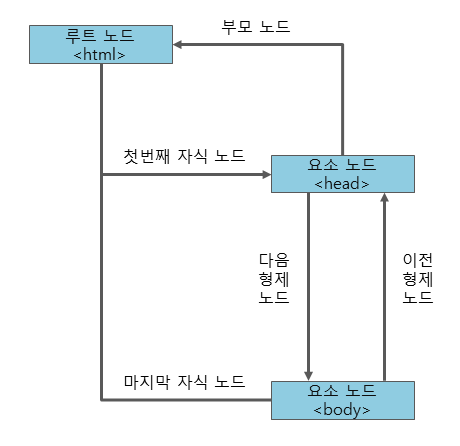

# 📌 DOM, Document Object Model
- XML이나 HTML문서에 접근하기 위한 일종의 인터페이스
- W3C의 표준 객체 모델
- 문서 내의 모든 요소를 **계층으로 표현**하고, 각 **요소에 접근하는 방법**을 제공하여 생성, 변형, 삭제 할 수 있도록 한다.

> DOM 계층 구조


<br>

### ✅ DOM의 종류
W3C DOM 표준은 세가지 모델로 구분된다.
1. **Core DOM** : 모든 문서 타입을 위한 DOM 모델
2. **HTML DOM** : HTML 문서를 위한 DOM 모델
3. **XML DOM** : XML 문서를 위한 DOM 모델

<br>

# 📌 Document 객체
- 웹 페이지 그 자체
- 웹 페이지에 존재하는 HTML 요소에 접근하려면 Document 객체부터 시작해야 한다.

<br>

### ✅ Document 메서드
- **HTML 요소의 선택**
    - `document.getElementsByTagName(태그이름)` : 해당 태그 이름의 요소를 모두 선택
    - `document.getElementById(아이디)` : 해당 아이디의 요소를 선택
    - `document.getElementsByClassName(클래스이름)` : 해당 클래스에 속한 요소를 모두 선택
    - `document.getElementsByName(name속성값)` : 해당 name 속성값을 가지는 요소를 모두 선택
    - `document.querySelectorAll(선택자)` : 해당 선택자로 선택되는 요소를 모두 선택

    <br>


- **HTML 요소의 생성**
    - `document.createElement(HTML요소)` : 지정된 HTML 요소를 생성
    - `document.write(텍스트)` : HTML 출력 스트림을 통해 텍스트를 출력

    <br>


- **HTML 이벤트 핸들러 추가**
    - `document.getElementById(아이디).onclick = function() {실행할 코드}` : 마우스 클릭 이벤트와 연결될 이벤트 핸들러 코드를 추가

    <br>

- **HTML 객체의 선택**
    - `document.body` : body 요소를 반환
    - `document.images` : img 요소를 모두 반환함
    - [더보기](http://www.tcpschool.com/javascript/js_dom_document)

<br>

# 📌 노드
- DOM은 노드라고 불리는 계층적 단위에 정보를 저장한다.
- DOM은 이러한 노드들을 정의하고 그들 사이의 관계를 설명해주는 역할을 한다.

<br>

### ✅ 노드의 종류
|노드|설명|
|:-:|-|
|문서 노드(document node)|HTML 문서 전체를 나타내는 노드|
|요소 노드(element node)|모든 HTML 요소. 속성 노드를 가질 수 있는 유일한 노드|
|속성 노드(attribute node)|모든 HTML요소의 속성. 요소 노드에 대한 정보를 가지고 있음, 해당 요소 노드의 자식 노드에는 포함되지 않음|
|텍스트 노드(text node)|HTML 문서의 모든 텍스트|
|주석 노드(comment node)|HTML 문서의 모든 주석|

<br>

### ✅ 노드 간의 관계

- 모든 노드는 서로 계층적 관계를 맺음
- 노드 트리의 가장 상위에는 단 하나의 루트 노드가 존재
- 모든 요소 노드는 자식 노드를 가질 수 있음

<br>

### ✅ 노드로의 접근
#### 👉 getElementsByTagName() 메서드를 이용하여 접근
- 특정 태그 이름을 가지는 모든 요소를 노드 리스트 형태로 반환

<br>

#### 👉 노드 간의 관계를 이용하여 접근
- 부모 노드 접근
    - parentNode : 부모 노드
    - parentElement : 부모 요소 노드

    <br>

- 자식 노드 접근
    - childNodes : 모든 종류의 자식 노드 참조
    - firstChild : 첫번째 자식 노드
    - lastChild : 마지막 자식 노드
    - children : 자식 노드 중 요소 노드 참조
    - firstElementChild : 첫번째 자식 요소 노드
    - lastElementChild : 마지막 자식 요소 노드

    <br>

- 형제 노드 접근
    - nextSibling : 다음 형제 노드
    - previousSibling : 이전 형제 노드
    - nextElementSibling : 다음 형제 요소 노드
    - previousElementSibling : 이전 형제 요소 노드

<br>

### ✅ 노드에 대한 정보
- nodeName
    - 노드 고유의 이름을 저장, 읽기 전용 프로퍼티
```javascript
// HTML 문서의 모든 자식 노드 중에서 두 번째 노드의 이름을 선택함.
document.getElementById("document").innerHTML = document.childNodes[1].nodeName; // HTML


// html 노드의 모든 자식 노드 중에서 첫 번째 노드의 이름을 선택함.
document.getElementById("html").innerHTML = document.childNodes[1].childNodes[0].nodeName; // HEAD
```

<br>

- nodeValue
    - 노드의 값 저장
```javascript
var para = document.getElementById("text"); // id가 "text"인 요소 선택

function changeText() {
    para.firstChild.nodeValue = "텍스트 변경 완료!";
}
```

<br>

- nodeType
    - 노드 고유의 타입을 저장, 수정할 수 없는 읽기 전용 프로퍼티
```javascript
document.getElementById("document").innerHTML = document.nodeType; // 9
```

|노드|프로퍼티 값|
|:-:|:-:|
|요소 노드(element node)|1|
|속성 노드(attribute node)|2|
|텍스트 노드(text node)|3|
|주석 노드(comment node)|8|
|문서 노드(document node)|9|

<br>

### ✅ 노드 관리
#### 👉 노드 추가
- appendChild() : 새로운 노드를 해당 노드의 자식 노드 리스트 맨 마지막에 추가
```javascript
function appendNode() {

    var parent = document.getElementById("list");  // id가 "list"인 요소를 선택
    var newItem = document.getElementById("item"); // id가 "item"인 요소를 선택

    parent.appendChild(newItem); // 해당 요소의 맨 마지막 자식 노드로 추가
}
```

<br>

- insertBefore() : 새로운 노드를 특정 자식 노드 바로 앞에 추가
```javascript
function appendNode() {

    var parent = document.getElementById("list"); // id가 "list"인 요소를 선택
    var criteriaItem = document.getElementById("criteria"); // id가 "criteria"인 요소를 선택함.
    var newItem = document.getElementById("item"); // id가 "item"인 요소를 선택함.
 
    parent.insertBefore(newItem, criteriaItem); // 해당 노드를 기준이 되는 자식 노드의 바로 앞에 추가함.
}
```

<br>

#### 👉 노드 생성
- createElement() : 요소 노드 생성
```javascript
function createNode() {

    var criteriaNode = document.getElementById("text"); // 기준이 되는 요소로 id가 "text"인 요소를 선택함.
    var newNode = document.createElement("p");          // 새로운 <p> 요소를 생성함.
    newNode.innerHTML = "새로운 단락입니다.";
    document.body.insertBefore(newNode, criteriaNode);  // 새로운 요소를 기준이 되는 요소 바로 앞에 추가함.
}
```

<br>

- createAttribute() : 속성 노드 생성
```javascript
function createNode() {

    var text = document.getElementById("text");           // id가 "text"인 요소를 선택함.
    var newAttribute = document.createAttribute("style"); // 새로운 style 속성 노드를 생성함.
    newAttribute.value = "color:red";
    text.setAttributeNode(newAttribute);                  // 해당 요소의 속성 노드로 추가함.
}
```

<br>

#### 👉 노드 제거
- removeChild() : 자식 노드 리스트에서 특정 자식 노드 제거
```javascript
var parent = document.getElementById("list");      // id가 "list"인 요소를 선택함.
var removedItem = document.getElementById("item"); // id가 "item"인 요소를 선택함.
parent.removeChild(removedItem);                   // 지정된 요소를 삭제함.
```

<br>

- removeAttribute() : 속성의 이름을 이용하여 특정 속성 노드 제거
```javascript
var text = document.getElementById("text"); // id가 "text"인 요소를 선택함.
text.removeAttribute("style");              // 해당 요소의 "style" 속성을 제거함.
```