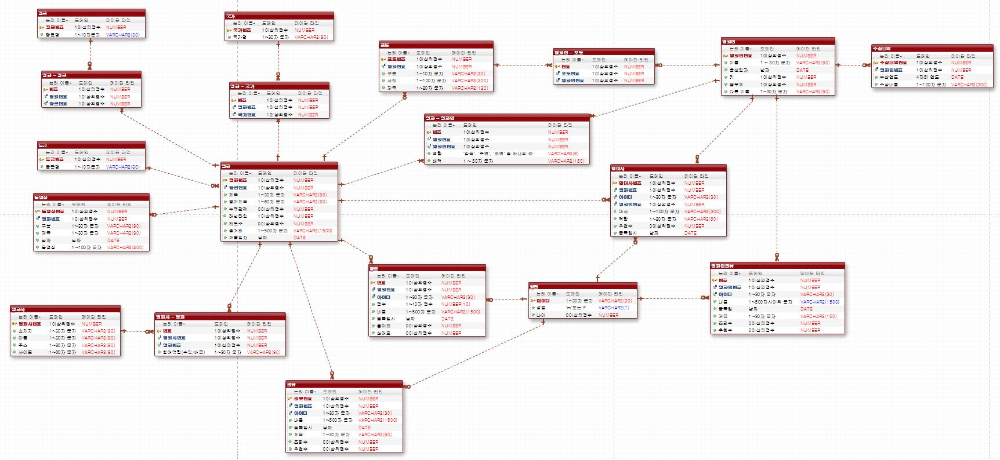

# 👩‍💻 네이버 영화 랭킹 DB
[네이버 영화 랭킹 페이지](https://movie.naver.com/movie/sdb/rank/rmovie.naver)에서 필요한 데이터를 저장하기 위한 테이블을 설계, 생성, 조작한다.

### 1️⃣ 데이터 수집 및 분석
- 1위~ 50위, 총 50편의 영화에 대해 필요로 하는 데이터는 다음과 같다.

|구분|필요 정보|
|:--:|:--:|
|영화|제목, 영어제목, 장르, 국가, 러닝 타임, 개봉일자, 감독, 출연진, 등급, 누적 관객, 좋아요, 줄거리|
|배우/제작진|배우명, 포지션, 배역|
|평점|별점, 내용, 작성자, 작성일자|
|리뷰|제목, 내용, 작성자, 작성일자, 추천수|
|명대사|대사, 배역, 배우명, 작성자, 추천수, 작성일자|


<br>

### 2️⃣ ERD 작성

- **논리 ERD** 작성 후, 실제로 테이블 생성 시 사용될 **물리 ERD**를 작성한다.
- 각 테이블의 컬럼이 **원자값**을 가질 수 있도록 **테이블을 분리**한다. (e.g. 영화인의 수상내역 테이블)
- N:N 관계를 가질 수 정보는 **연결 정보를 저장할 테이블을 별도로 생성**한다. (e.g. 장르, 국가 테이블)
- 복합키를 사용하는 대신, 각 테이블마다 **기본키**인 **번호(seq) 컬럼**을 두어 다른 테이블에서 참조하도록 했다.

<br>

### 3️⃣ DDL 및 DML 작성
#### ✔ 테이블 생성
- 제약사항 설정 시 constraint 키워드를 사용하지 않고 컬럼에서 설정해주었다.
- 가독성을 위해 null 조건도 표기해주었다.
```sql
-- 영화
create table tblMovie (
	seq number primary key,
	rseq number not null references tblRating(seq),
	title varchar2(90) not null,
    engtitle varchar2(90) not null,
    audience number null,
    runningtime number null,
    likes number null,
    summary varchar2(1500) not null,
    releasedate date not null
);
```


#### ✔ 데이터 삽입
- 시퀀스 객체의 nextVal을 사용해 일련번호를 계산하지 않고 삽입할 수 있었다.
```sql
-- 영화인
insert into tblMoviePerson values(seq.nextval,'드니 데르쿠르', to_date('1964-10-01','yyyy-mm-dd'), null, null, null);
insert into tblMoviePerson values(seq.nextval,'유연석', null, 183, 73, null);
insert into tblMoviePerson values(seq.nextval,'올가 쿠릴렌코', to_date('1979-11-14','yyyy-mm-dd'), 175, null, null);
insert into tblMoviePerson values(seq.nextval,'예지원', to_date('1973-02-01','yyyy-mm-dd'), 165, 45, '이유정');
insert into tblMoviePerson values(seq.nextval,'이승준', null, 175, 68, null);
insert into tblMoviePerson values(seq.nextval,'성지루', null, null, null, null);
insert into tblMoviePerson values(seq.nextval,'박소이', to_date('2012-03-12','yyyy-mm-dd'), null, null, null);
insert into tblMoviePerson values(seq.nextval,'아누팜 트리파티', to_date('1981-06-19','yyyy-mm-dd'), 172, null, '아누팜');
```

<br>


### ✨ 느낀점 및 보완할 점

#### ✔ 정규화
영화인 테이블에서 NULL 값이 빈번하게 들어가는 컬럼이 많아, **1차 정규화**를 수행하여 NULL 값이 들어가는 행이 줄었으면 좋았을 것 같다.
#### ✔ 제약사항 관리
컬럼에 바로 제약사항을 명시했지만, 컬럼이 많은 경우에는 일일이 컬럼을 확인하면서 관리하는 것이 번거로울 것 같다. 또한 에러 발생 시 에러 메세지만으로 오류의 위치를 발견하기 쉽지 않았다. **CONSTRAINT** 또는 **ALTER**를 사용해서 **제약사항의 이름을 정의하고 따로 관리**하는 것이 용이할 것 같다.
#### ✔ 시퀀스 객체 이름
시퀀스 객체를 편의상 하나만 정의하고 각 테이블마다 drop, create를 반복했는데 데이터가 추가될 때 일련번호 관리가 어려울 것 같다. 관리를 위해 **각 테이블마다 다른 시퀀스 객체**를 사용하는 것이 좋을 것 같다.
